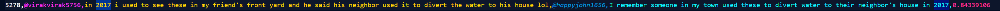
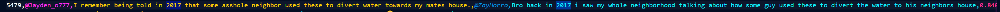

# Bot Detector

#### 1. Acquire an API Key for youtube.

- You can create a project and get an API key here: `https://console.cloud.google.com`

#### 2. Create a class object

```
    url = "https://youtube.com/shorts/qYcVT3BAQJA?si=McC5WjFirpPaW_JB"
    bot_detector = YouTubeDetector(url)
```

#### 3. Run a similarity search

```
    matches = bot_detector.get_text_similarity()
    matches.to_csv("./matches.csv")
```

#### 4.

- This is the output once we run a similarity search.
- I noticed bots were referencing a "flood in 2017" across multiple comments.
- This will group these comments together and rank them towards the top.

- _IT SHOULD BE NOTED_: This method does not have 100% accuracy. Some human users may genuinely comment repititous text. It is up to you to make the final determination.



